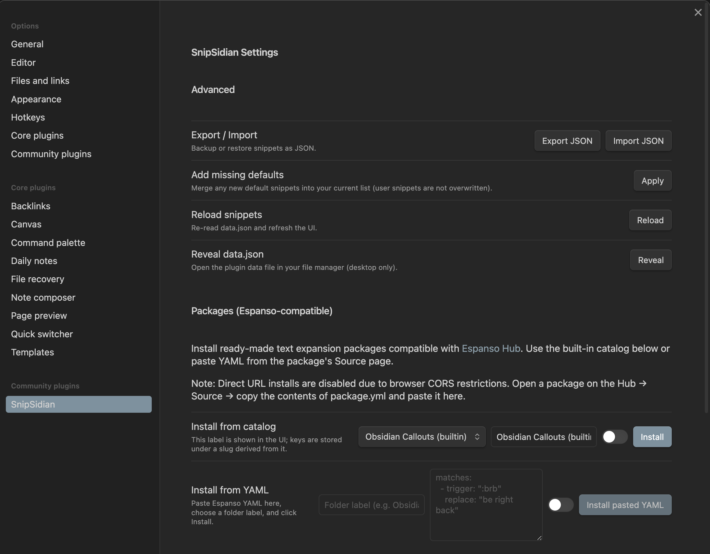
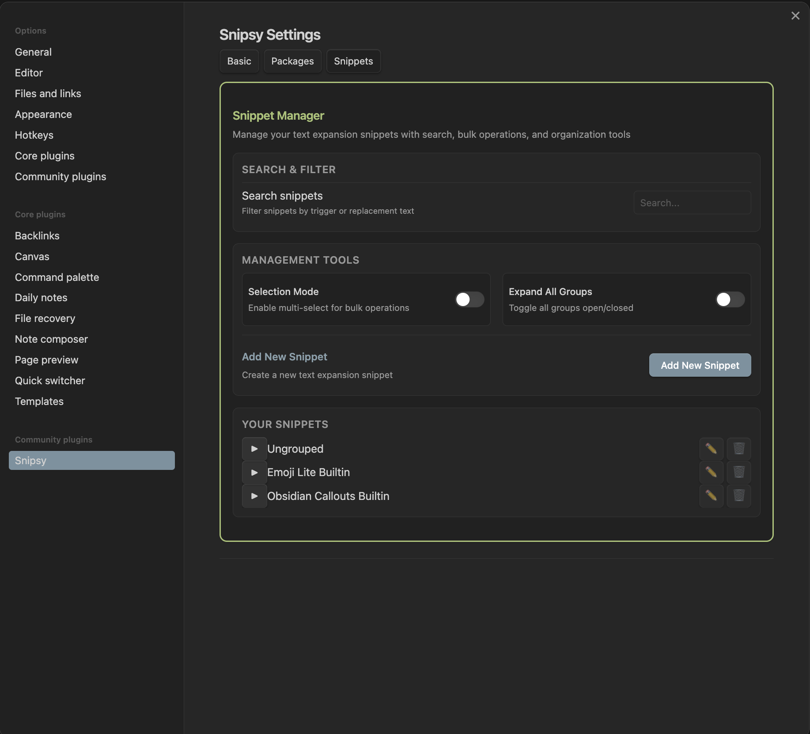
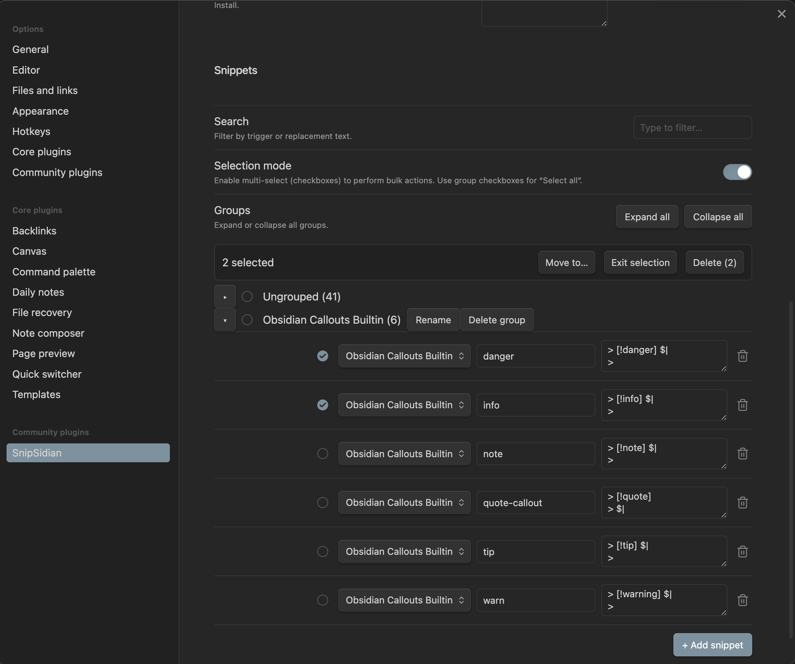

# Snipsy

[](https://github.com/Dimagious/snipsidian/actions/workflows/ci.yml)
[](https://codecov.io/gh/Dimagious/snipsidian)
[](https://github.com/Dimagious/snipsidian/releases)


[](https://buymeacoffee.com/dimagious)

Snipsy is an Obsidian plugin that brings **hotstrings / text snippets expansion** to your notes.  
Type `:todo` → instantly get `- [ ]`. Type `:warn` → expand into a callout block.  
Organize, bulk edit, and supercharge your Markdown workflow — without leaving Obsidian.

---

## 🚀 Demo


---

## ✨ Features

- 🔑 **Triggers → replacements** (e.g., `brb` → `be right back`).
- ⚡ **Auto-expand** after space, Enter, or punctuation.
- 🗂 **Folders & groups:** organize snippets, rename or delete groups, move snippets between them.
- ✅ **Selection mode:** multi-select with checkboxes, bulk delete or bulk move.
- 📦 **Package manager:**
  - Install from the **built-in curated catalog**.
  - Paste YAML from [Espanso Hub](https://hub.espanso.org/).
  - Preview conflicts before installing.
- 🔄 **Import/Export JSON**, reveal `data.json` in your vault, merge defaults.
- 🖥 **Polished UX:** expand/collapse all, remember folder states, responsive modals.

---

## 📚 Built-in Snippet Packs

Snipsy ships with a ready-to-use catalog:

| Pack               | Preview |
| ------------------ | ------- |
| **Emoji (lite)**   | 😀 😂 ❤️ 🔥 👍 |
| **Task states**    | - [ ] todo &nbsp;&nbsp; - [x] done &nbsp;&nbsp; - [/] doing |
| **Markdown basics**| `**bold**` &nbsp;&nbsp; `_italic_` &nbsp;&nbsp; \`\`\`code\`\`\` |
| **Markdown tables**| \| H1 \| H2 \| <br> \| --- \| --- \| <br> \| … \| … \| |
| **Unicode arrows** | → ← ↑ ↓ ↔ |
| **Math symbols**   | ± × ÷ ≤ ≥ ≠ ≈ µ ° ∞ |
| **Callouts**       | > [!note] Note <br> > [!warning] Warning <br> > [!success] Success |

👉 Need more? Paste any **[Espanso-compatible package](https://hub.espanso.org/search)** (YAML) right into Snipsy.

---

## ⚡ Quick start

1. Open **Settings → Community plugins** in Obsidian and install **Snipsy**.
2. Enable it, then go to **Settings → Snipsy**.
3. Create your own snippets, or install a package from the catalog.
4. Type triggers in the editor → watch them expand instantly.

---

## 📐 Expansion rules

- Expands after **space / Enter / punctuation**.
- Conservatively checks **word boundaries** to avoid false positives.
- Markdown-aware: **no expansion** inside code blocks, inline code, or YAML frontmatter.

---

## 🗄 Data & sync

Snippets are stored in:

```
.obsidian/plugins/snipsidian/data.json
```
They sync across devices with your vault.  
Groups are saved as `folder/trigger` under the hood for portability.

## 🛠 Development

### Local build into your vault

1. Set the env var once (macOS zsh example):
   ```bash
   echo 'export VAULT_PLUGIN="<path-to-your-vault>/<your-vault>/.obsidian/plugins/snipsidian"' >> ~/.zshrc
   source ~/.zshrc
   ```
2. Install deps & build:
   ```bash
   npm install
   npm run build:vault     # builds main.js/styles/manifest straight into your vault
   ```
3. For watch mode:
   ```bash
   npm run dev:vault
   ```
4. In Obsidian: **disable → enable** the plugin to reload.

> Alternatively, `npm run build` produces `main.js` in the repo root; copy it to the plugin folder manually.

## Screenshots

**Settings – package install (catalog & YAML)**


| Snippets manager                       | Selection mode                                |
| -------------------------------------- | --------------------------------------------- |
|  |  |

## Contributing

PRs welcome! Please keep changes small and focused. For feature ideas, open an issue first.

## License

MIT

## Coverage

- Online report: **Codecov** → https://codecov.io/gh/Dimagious/snipsidian
- Local HTML: `npm run coverage` (отчёты в `coverage/` → открой `coverage/index.html`)
