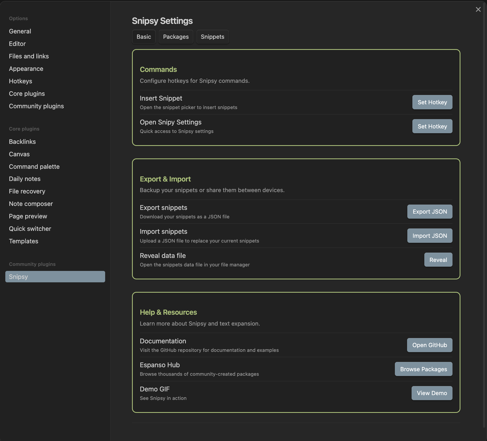
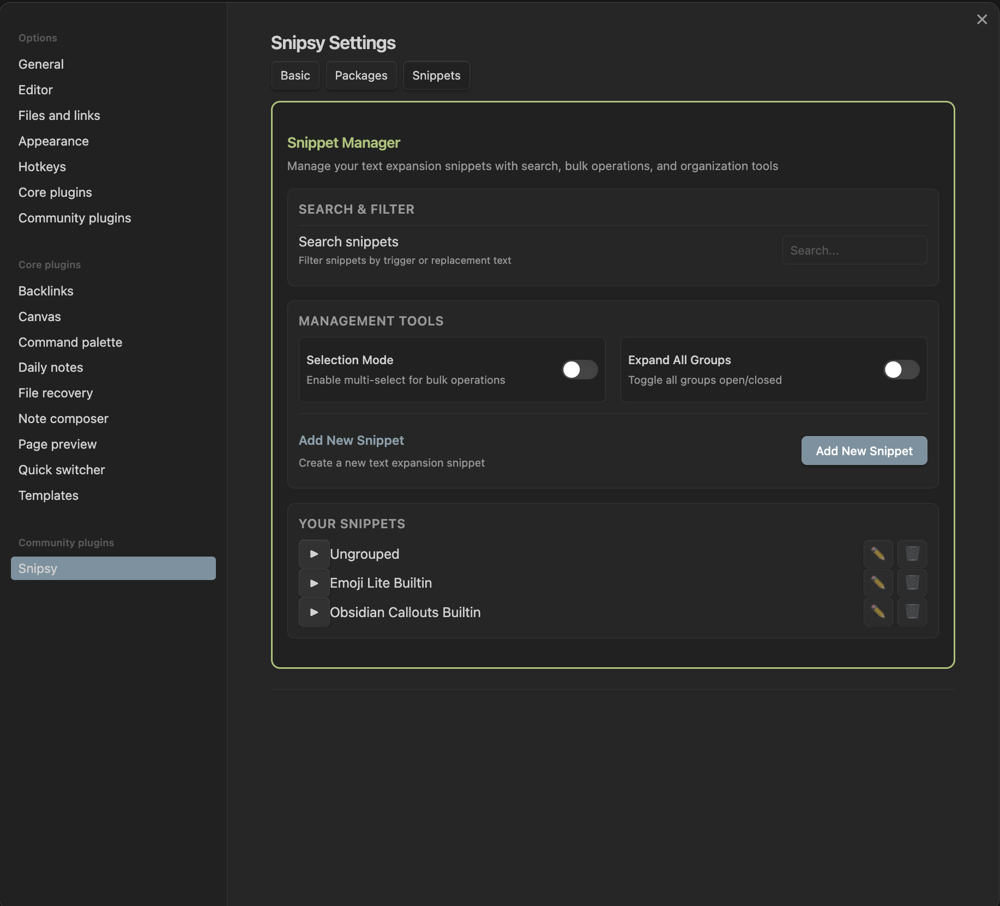
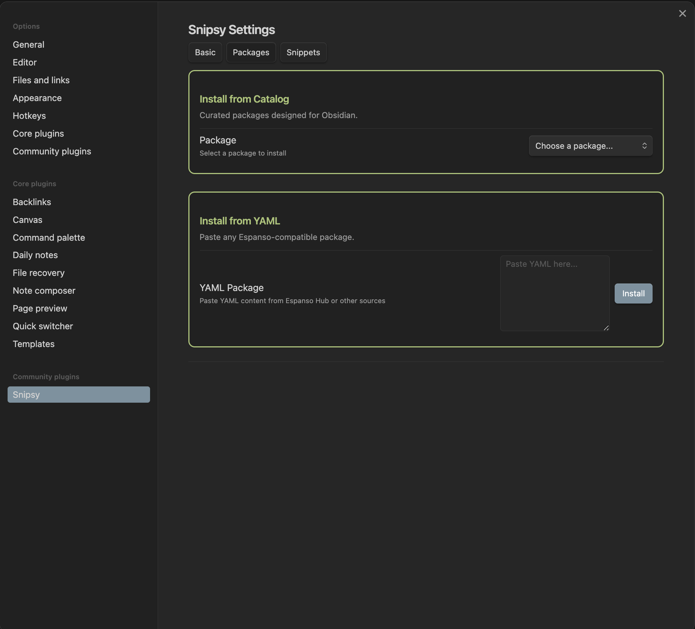

# Snipsy

[](https://github.com/Dimagious/snipsidian/actions/workflows/ci.yml)
[](https://codecov.io/gh/Dimagious/snipsidian)
[](https://github.com/Dimagious/snipsidian/releases)


[](https://buymeacoffee.com/dimagious)

> **Type `:todo`, get `- [ ]`.** Snipsy is the actively-maintained hotstring plugin for Obsidian — markdown-aware, with a community catalog and Espanso import. No scripting required.


---

## Why Snipsy

The text-expansion niche in Obsidian has three things wrong with it: the long-standing leader hasn't shipped in four years, the alternatives lean on JavaScript-templating engines, and none of them is aware of markdown context. Snipsy is the simple answer:

- **Actively maintained.** Regular releases, every change passes CI with attested artifacts. Latest scan: 0 vulnerable dependencies, 0 scorecard warnings.
- **Markdown-aware.** Triggers don't fire inside fenced code blocks, inline code, or YAML frontmatter. Most competitors don't draw that line.
- **No scripting.** If you need JavaScript or dynamic templates, use [Templater](https://github.com/SilentVoid13/Templater) — it's purpose-built for that. Snipsy is for users who want hotstrings with zero setup.
- **Community catalog.** Browse curated packages straight from the plugin. Or paste any [Espanso Hub](https://hub.espanso.org/) package's YAML and install it.

---

## Try these out of the box

Snipsy ships with a starter set you can use immediately:

| Pack | Examples |
|---|---|
| **Task states** | `:todo` → `- [ ]` · `:done` → `- [x]` · `:doing` → `- [/]` |
| **Markdown basics** | `:bold` → `**text**` · `:italic` → `_text_` · `:code` → `` `code` `` |
| **Obsidian callouts** | `:note` → `> [!note]` · `:warning` → `> [!warning]` |
| **Tables** | `:table` → 3×3 scaffold |
| **Emojis** | `:smile` → 😀 · `:heart` → ❤️ · `:fire` → 🔥 |
| **Unicode arrows** | `:arrow` → → · `:left` → ← · `:up` → ↑ |
| **Math symbols** | `:plus` → ± · `:times` → × · `:leq` → ≤ |

Need more? Browse the community catalog in **Settings → Snipsy → Community packages**, or paste any Espanso `.yml` from [hub.espanso.org](https://hub.espanso.org/) into the **Espanso import** section.

---

## Quick start

1. **Install** Snipsy from Obsidian's **Settings → Community plugins → Browse**.
2. **Enable** it.
3. **Open a Markdown note** and type `:todo ` (with the trailing space). It expands to `- [ ]`.

That's it. Open **Settings → Snipsy** to add your own snippets, browse the catalog, or set up hotkeys.

### Add a snippet

**Settings → Snipsy → Snippets** → **Add new snippet** → pick a trigger (e.g. `:email`) and replacement (e.g. `you@example.com`). Save. Now `:email ` expands anywhere you type.

### Set up the picker hotkey

The picker is a Command Palette command called **Insert snippet…** — it's searchable, has a live preview, and inserts at the cursor. To set a hotkey: **Settings → Hotkeys** → search "snipsy" → bind.

---

## How expansion works

Snipsy watches for triggers followed by a **separator** — a space, Enter, or common punctuation. The trigger and separator together get replaced.

```
Type:    "I need to :todo buy groceries"
Result:  "I need to - [ ] buy groceries"

Type:    "Remember: :note important meeting"
Result:  "Remember: > [!note] important meeting"
```

What's safe:

- ✅ Triggers don't expand mid-word
- ✅ Triggers don't expand inside fenced code blocks (`` ``` ``)
- ✅ Triggers don't expand inside inline code (`` ` ``)
- ✅ Triggers don't expand inside YAML frontmatter
- ✅ The cursor lands where the snippet defines it (`$|`), with support for `$date` / `$time` / `$filename` / `$clipboard` placeholders and `$1`/`$2` tabstops

---

## Packages

Snipsy has two ways to get pre-made snippets:

**Community catalog.** Hosted at [Dimagious/snipsidian-community](https://github.com/Dimagious/snipsidian-community). Open **Settings → Snipsy → Community packages**, browse the list, click Install. Each pack lives in its own group so you can uninstall it later by deleting the group.

**Espanso import.** Most Espanso packages are plain YAML. Copy the YAML from any package on [Espanso Hub](https://hub.espanso.org/), paste it into **Espanso import**, click Install. Conflicts open a preview so you can resolve them before anything writes to disk.

---

## Privacy

Snipsy is offline-first.

- Reads/writes only `.obsidian/plugins/snipsidian/data.json` in your vault.
- Network: a single request to `api.github.com` when you open the Community packages tab (to list the catalog). No analytics, no telemetry, no account.
- Optional submission flow uses a Google Form (your choice to fill it in).

---

## Screenshots



| Snippets manager | Community packages |
|---|---|
|  |  |

---

## When Snipsy is NOT the right tool

Be honest: a few jobs are better served elsewhere.

- **Dynamic templates with JavaScript?** Use **[Templater](https://github.com/SilentVoid13/Templater)** — it owns this category.
- **System-wide expansion (in any app, not just Obsidian)?** Use **[Espanso](https://espanso.org/)** — runs as a background process.
- **Just want to retrieve and fuzzy-search snippets without auto-expansion?** **[Snippets Manager](https://github.com/ramandv/obsidian-snippets-manager)** is closer to that use case.

Snipsy fits between these — hotstring-style auto-expansion, inside Obsidian, with a catalog. No more, no less.

---

## Project status

Active. Releases are tag-driven; the [release workflow](.github/workflows/release.yml) attests build provenance for every binary it ships. The [`CHANGELOG.md`](CHANGELOG.md) is a Keep-a-Changelog file maintained on every release.

If something breaks, [open an issue](https://github.com/Dimagious/snipsidian/issues). Bug reports help; "this isn't working" without steps doesn't.

---

## Development

If you're building / contributing, the short version:

```bash
git clone https://github.com/Dimagious/snipsidian.git
cd snipsidian
npm install
npm run build:vault   # build into VAULT_PLUGIN
npm test              # vitest with coverage
```

Set `VAULT_PLUGIN` to your test vault's plugin folder:

```bash
export VAULT_PLUGIN="/path/to/vault/.obsidian/plugins/snipsidian"
```

Full conventions, release flow, and architecture notes live in [`CLAUDE.md`](https://github.com/Dimagious/snipsidian/blob/main/CLAUDE.md) (when present locally; ignored from the repo).

---

## License

[MIT](LICENSE). Use it, fork it, share it.

## Acknowledgments

[Espanso](https://espanso.org/) — inspiration and YAML format. [Obsidian](https://obsidian.md/) — the plugin host. Everyone who's filed a bug or suggested a feature so far.

## Support

If Snipsy saves you keystrokes:

- ⭐ **Star** the repo so others find it.
- 🐛 [**Open an issue**](https://github.com/Dimagious/snipsidian/issues) when something breaks.
- ☕ [**Buy me a coffee**](https://buymeacoffee.com/dimagious) if you want to encourage more work.

---

**Made for the Obsidian community.**
