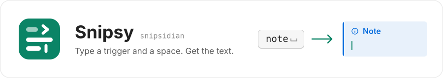

# Snipsy

<picture>
  <source media="(prefers-color-scheme: dark)" srcset="https://raw.githubusercontent.com/Dimagious/snipsidian/HEAD/docs/banner-dark.svg">
  
</picture>

[](https://community.obsidian.md/plugins/snipsidian)
[](https://github.com/Dimagious/snipsidian/releases)
[](https://github.com/Dimagious/snipsidian/stargazers)

[Install](#install) · [Defaults](#what-ships-with-it) · [Packages](#packages) · [Questions](#questions) · [Website](https://dimagious.github.io/snipsidian/)

Type `todo` and a space, get `- [ ]`. Snipsy turns short triggers into text as you write in
Obsidian. **No scripting, and no templates to learn.** It knows where markdown is code, so it
stays quiet in code blocks and frontmatter.

**[Take the tour on the website](https://dimagious.github.io/snipsidian/)**: every feature, a live
expansion demo, and screenshots in light and dark.

<video src="https://github.com/user-attachments/assets/8e54d0ec-9b86-4741-b697-0a0a981a127b" autoplay muted loop playsinline width="100%">
  <a href="docs/screens/demo.mp4">Watch the 60-second demo</a>
</video>

A snippet is two strings, a trigger and what it becomes:

```
note  →  > [!note]
         > |          ← the cursor lands here
```

## What it is used for

| What | How |
|---|---|
| [Task boxes, headings, emphasis without reaching for the toolbar](#what-ships-with-it) | the Defaults group |
| [Today's date, the current time, the note's name](#placeholders) | `$date`, `$time`, `$filename` |
| [Meeting notes, a weekly review, code review labels](#packages) | the community catalog |
| [The snippets you already have in Espanso](#espanso-import) | Espanso import |

## What ships with it

Sixteen triggers, in one group called **Defaults**. Type the trigger, then a space.

| Trigger | Becomes |
|---|---|
| `todo` · `done` | `- [ ] ` · `- [x] ` |
| `h1` · `h2` · `h3` | `# ` · `## ` · `### ` |
| `bold` · `italic` · `code` | `**\|**` · `_\|_` · `` `\|` ``, cursor inside |
| `note` | a `> [!note]` callout, cursor on the body line |
| `table` | a 3×3 table, cursor in the first cell |
| `today` · `now` | `2026-09-28` · `14:05` |
| `brb` · `omw` · `ty` · `imo` | be right back · on my way · thank you · in my opinion |

Delete the group and it stays deleted. **Settings → Snipsy → General → Restore default
snippets** brings back the missing ones and leaves everything you added alone.

## How it differs from a template plugin

Templater and friends run code to build text. Snipsy swaps a word for a string. Four
consequences of that, worth knowing before you install anything:

- **Nothing to learn.** A snippet is a trigger and a replacement. The one bit of syntax is
  `$|`, the spot where the cursor lands.
- **It reads markdown.** A trigger inside a fenced code block, inline code or YAML
  frontmatter stays as you typed it. So does a trigger in the middle of a word.
- **Only your typing fires it.** Pasting text that ends in `todo `, undo, redo, drag and
  drop, another plugin's edit, IME composition for Chinese, Japanese or Korean: none of these
  expand anything.
- **It works on your phone.** Same snippets, same picker.

What it does not do: JavaScript or dynamic templates (that is
[Templater](https://github.com/SilentVoid13/Templater)), expansion outside Obsidian
([Espanso](https://espanso.org/)), Tab-stops that jump between fields.

## Install

Settings → **Community plugins** → **Browse** → search for **Snipsy** → Install → Enable.

Then open a note, type `todo` and a space.

For the snippets you do not remember by name, run **Snipsy: Insert snippet…** from the command
palette. It searches triggers and replacements, previews the result, and inserts at the cursor.
Select some text first and `$1` in the snippet receives it. **Settings → Snipsy → General →
Set hotkey** opens the Hotkeys tab already filtered to that command.

## How expansion works

A trigger expands when a separator lands after it: a space, Tab, Enter, or one of
`. , ! ? ; : ( ) [ ] { } " '`. The separator stays where you typed it.

```
You type:   todo·
You get:    - [ ] ·
```

`·` is the space you typed. Undo right after an expansion takes back the trigger and the
expansion together, in one step.

### Prefix mode

If `now` or `today` keeps turning into a time in the middle of your sentences, you have three
answers. Delete that one snippet. Switch off the whole Defaults group with the toggle on its
header. Or turn on **Require a prefix before triggers** under **General → Expansion**: from
then on `todo` stays a word, and only `:todo` (or `;todo`, your pick) expands. The prefix is
eaten by the expansion. It is one switch for every snippet, off by default.

## Your own snippets

**Settings → Snipsy → Snippets → Add new snippet.** Trigger `sig`, replacement:

```
Best,
Dmitriy
```

Save, and `sig` followed by a space is your signature in every note.

### Placeholders

| Placeholder | Becomes |
|---|---|
| `$\|` | where the cursor lands after expanding |
| `$date` | today, `YYYY-MM-DD` |
| `$time` | now, `HH:MM` |
| `$filename` | the current note's name |
| `$clipboard` | what is on your clipboard at that moment |
| `$1` | the selected text, when you insert the snippet from the picker over a selection |

### Groups

Every snippet lives in a group. Packs and imports each get their own, so a whole pack comes
out the way it went in: delete its group. The toggle on a group's header mutes it without
deleting anything: its snippets stop expanding and leave the picker, and stay in the list,
dimmed, for when you want them back. Selection mode moves or deletes many at once; a delete
names the first five triggers before it asks.

## Packages

### Community catalog

**Settings → Snipsy → Packages.** Twelve packs, one click each:

| | |
|---|---|
| Markdown Essentials | Obsidian Power-User |
| Daily Journal | GTD & Productivity |
| Meetings | Developer Boilerplate |
| Code Review | Research & Academic |
| Symbols & Math | Date & Time |
| Obsidian Callouts | Basic Emojis |

Reinstalling a pack whose snippets you have edited opens a preview before anything is written:
keep your version or take the pack's, snippet by snippet. A pack that wants a trigger already
used by a different snippet in another group is not installed, and the notice names the
trigger. The catalog lives in
[Dimagious/snipsidian-community](https://github.com/Dimagious/snipsidian-community). Made a pack
worth sharing? The Packages tab opens a GitHub issue with it already filled in.

### Espanso import

Paste the YAML of any package from [hub.espanso.org](https://hub.espanso.org/), name a group,
press **Import snippets**. Espanso's cursor marker, clipboard variable and plain date variable
become `$|`, `$clipboard` and `$date`. Forms, scripts, shell commands, regex triggers and images
have no equivalent here. Those are skipped and named, "12 imported, 3 skipped: …", instead of
landing in your notes as broken `{{text}}`.

### Backup

**General → Export JSON** saves every snippet to a file, **Import JSON** brings them back. On
a phone, where browsers cannot download, the export lands in the vault root as
`snipsidian-snippets.json`.

## Privacy

Snipsy reads and writes one file: `.obsidian/plugins/snipsidian/data.json`. It goes online
only when you open the Packages tab, to `api.github.com` for the list and
`raw.githubusercontent.com` for the pack you install. No analytics, no telemetry, no account.

`$clipboard` reads your clipboard when a snippet with it expands. None of the defaults use it;
the install preview shows it when a third-party pack does.

## Questions

<details>
<summary>Will it fire inside my code blocks?</summary>

No. Fenced code, inline code and YAML frontmatter are left alone, and so is a trigger that
is part of a longer word.

</details>

<details>
<summary>It keeps expanding <code>now</code> in my sentences</summary>

Delete that snippet, switch off the Defaults group, or turn on prefix mode so only `:now`
expands. See [Prefix mode](#prefix-mode).

</details>

<details>
<summary>Does it work on my phone?</summary>

Yes. The plugin is not desktop-only, and the picker fits a phone screen.

</details>

<details>
<summary>Are <code>$1</code> and <code>$2</code> Tab-stops?</summary>

No. `$1` takes the selected text when you insert from the picker. There is no jumping between
fields with Tab, by design.

</details>

<details>
<summary>Does it send my notes anywhere?</summary>

No. See [Privacy](#privacy).

</details>

## If something is wrong, or missing

[Open an issue](https://github.com/Dimagious/snipsidian/issues) with what you typed and what
you got. Snipsy's own settings tab has an About page with the links.

The feature list is short on purpose. No scripting, no Tab-stops, one prefix switch for
everything. Those are decisions, and the fastest way to change one is to say what you tried to
do and could not.

## Development

```bash
npm install
npm test           # vitest, with coverage gates
npm run lint       # eslint + eslint-plugin-obsidianmd
npx tsc --noEmit
npm run build      # main.js + styles.css
```

| | |
|---|---|
| `npm run e2e` | the suite against a real Obsidian |
| `npm run scorecard:check` | mirrors the community-plugin review scanner |
| `npm run release:check` | versions in sync, tests, build |

`VAULT_PLUGIN="/path/to/vault/.obsidian/plugins/snipsidian" npm run dev:vault` builds straight
into a test vault and watches for changes.

The matching engine lives in `src/engine/`, which imports neither Obsidian nor the DOM and is
tested without mocks.

## License

[MIT](LICENSE) © Dmitriy Yurkin
